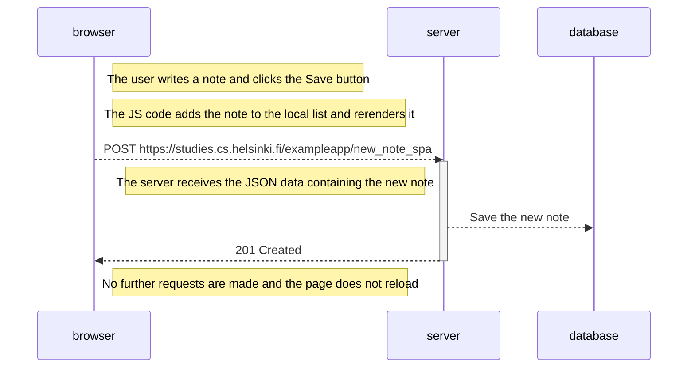

```mermaid
sequenceDiagram
   participant browser
   participant server
   participant database

   Note right of browser: The user writes a note and clicks the Save button
   Note right of browser: The JS code adds the note to the local list and rerenders it

   browser-->>server: POST https://studies.cs.helsinki.fi/exampleapp/new_note_spa
   activate server

   Note left of server: The server receives the JSON data containing the new note

   server-->>database: Save the new note

   server-->>browser: 201 Created

   deactivate server
   Note right of browser: No further requests are made and the page does not reload

```